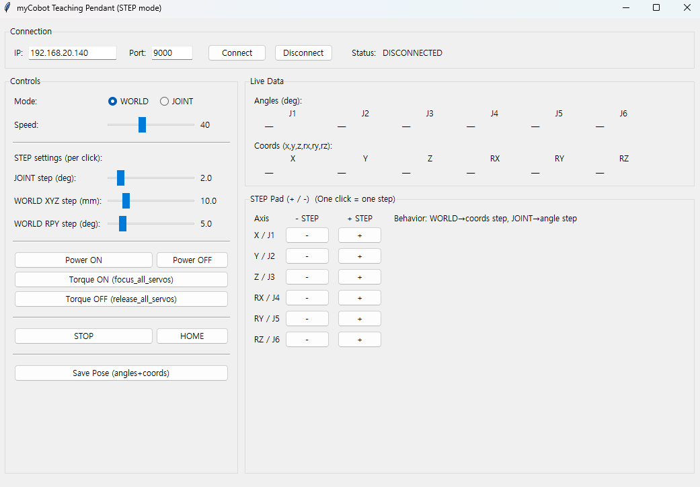

# myCobot 280 (Socket) — Step 기반 티칭 팬던트 + 기본 동작 예제

이 저장소는 **myCobot 280**를 **TCP Socket** 방식으로 제어하기 위한 **Python 예제 모음**입니다.  
특히, 클릭 기반 GUI에서 `jog_*` 류의 **연속(Jog) 이동이 네트워크 지연(TCP)과 이벤트 루프 때문에 “렉/밀림”처럼 느껴지는 문제**를 피하기 위해, **한 번 클릭 = 한 번 이동(=Step)** 으로 동작하는 **미니멀 티칭 팬던트(Teaching Pendant) GUI**를 제공합니다.

> ✅ 본 프로젝트는 **pymycobot v4 계열(MyCobotSocket)** 기준으로 작성되어 있습니다.  
> ✅ 로봇 측에서는 **공식 GitHub의 `Server_280.py`** 를 다운로드 받아 **로봇이 재부팅될 때마다 자동 실행**되도록 설정해 둔 상태를 전제로 설명합니다(아래 “로봇 측 서버 구성” 참고).

---

## 1) 프로젝트 구성(파일/코드 블록 설명)

본 대화에 포함된 코드는 크게 3가지 성격으로 나뉩니다.

1. **연결 확인 및 API 메서드 목록 출력 예제**
   - `is_controller_connected()`, `get_angles()` 등을 호출하여 통신 상태를 검증
   - `dir(mc)` 기반으로 myCobot 객체가 제공하는 callable 메서드들을 나열하여 디버깅/탐색

2. **Step 기반 티칭 팬던트 GUI (Tkinter)**
   - Connect/Disconnect
   - Motor Power ON/OFF
   - Servo Torque ON/OFF (focus/release)
   - Live Angles + Coords 표시
   - WORLD/JOINT 모드 전환
   - 6축 +/- Step 이동
   - Speed / Step 크기 설정
   - STOP / HOME
   - 현재 Pose(angles+coords)를 JSONL 파일로 저장  


3. **관절(Joint) 이동 2개 + 직선(Linear) 이동 2개 예제**
   - `send_angles()` : 관절 각도 기반 이동
   - `send_coords(..., mode=1)` : 직선(리니어) 이동 예시(단, 로봇 펌웨어/서버 구현에 따라 동작 특성이 달라질 수 있음)

> 권장: GitLab 배포 시 아래처럼 파일을 나누면 관리가 편합니다.
>
> - `examples/00_list_methods.py`
> - `gui/pendant_step_mode.py`
> - `examples/01_basic_motion.py`
>
> 하지만, 이미 하나의 파일로 운영 중이라면 그대로 사용하셔도 됩니다.

---

## 2) 동작 원리 개요

### 2.1 Socket 제어 구조(왜 Server_280.py가 필요한가?)
- `MyCobotSocket(ip, port)` 는 **로봇에 떠 있는 서버**(보통 9000 포트)를 통해 명령을 주고받습니다.
- 따라서 PC에서 Python 코드를 실행하기 전에, **로봇 측에서 Server_280.py가 실행 중이어야** 합니다.
- 이 서버는 “로봇 내부 제어기 ↔ 네트워크(TCP)”를 연결하는 게이트웨이 역할을 합니다.

### 2.2 왜 Step 기반(한 번 클릭 = 한 번 이동)인가?
GUI 버튼에서 “누르고 있는 동안 계속 움직이는” **연속 jog**는 다음 문제가 자주 발생합니다.

- TCP 왕복 지연 + Tkinter 이벤트 루프(메인 스레드)로 인해
  - 클릭/릴리즈 타이밍이 어긋남
  - 명령이 밀려서 로봇이 “원하는 대로 안 움직이는 느낌”
  - 연속 명령 폭주(spam)로 제어가 불안정해짐

이 프로젝트는 다음 방식으로 해결합니다.

- 현재 상태를 읽음 (`get_angles()` 또는 `get_coords()`)
- 목표값을 “한 스텝만큼” 더해 계산
- 그 목표값을 **한 번의 absolute command**로 전송 (`send_angles()` 또는 `send_coords()`)
- 동시에 이동 명령 중복을 막기 위해 `threading.Lock()` 로 **동시 명령을 차단**

---

## 3) 사전 준비물 / 요구사항

### 3.1 PC(클라이언트) 환경
- Python 3.8+ 권장
- Windows / Ubuntu 모두 가능
- 필수 라이브러리
  - `pymycobot` (v4.x)
  - Tkinter (대부분 Python 기본 포함, Linux는 별도 설치 필요할 수 있음)

#### 설치(예시)
```bash
pip install pymycobot==4.0.3
```

> Tkinter 관련:
> - Windows: 기본 포함인 경우가 많음
> - Ubuntu: `sudo apt-get install python3-tk` 로 설치하는 경우가 많음

---

## 4) 로봇 측 서버 구성(중요)

### 4.1 현재 구성 요약(사용자 환경 기준)
아래는 사용자가 이미 완료해 둔 구성입니다(README에 포함 요청하신 내용).

- **pymycobot 4 버전으로 업데이트 완료**
- **공식 GitHub에서 `Server_280.py` 다운로드 완료**
- 로봇이 **재부팅될 때마다 `Server_280.py`가 자동 실행되도록 설정 완료**
- 로봇은 **회사 Wi‑Fi에 자동 접속**
- 따라서 PC에서는 로봇에서 `ifconfig` 로 확인한 IP로 접속하면 즉시 사용 가능

### 4.2 로봇 IP 확인 방법
로봇(리눅스) 터미널에서:
```bash
ifconfig
```

- 보통 `wlan0` 또는 `eth0` 같은 인터페이스 아래에 `inet 192.168.x.x` 형태로 IP가 표시됩니다.
- 그 IP를 PC 코드에 넣어서 접속합니다.

예:
```python
from pymycobot import MyCobotSocket
mc = MyCobotSocket("192.168.31.239", 9000)
```

### 4.3 포트(기본 9000)
- `Server_280.py` 가 기본적으로 9000 포트를 사용하는 경우가 많습니다.
- 이 README의 예제도 `9000` 을 기본으로 사용합니다.

> 만약 포트가 다르면(서버 스크립트에서 바뀌었거나 실행 옵션이 다르면)  
> GUI의 Port 칸과 코드의 포트를 동일하게 맞추세요.

### 4.4 “재부팅 시 자동 실행”을 왜 해두면 좋은가?
- 현장 데모/연구 환경에서 로봇이 재부팅될 때마다 서버를 다시 띄우는 과정이 번거롭습니다.
- 자동 실행을 해두면:
  - PC에서 IP만 맞추면 언제든 접속 가능
  - 운영/시연 안정성이 크게 올라감

---

## 5) 빠른 시작(Quick Start)

### 5.1 통신/상태 확인 & 메서드 목록 보기
```python
from pymycobot import MyCobotSocket

mc = MyCobotSocket("192.168.31.239", 9000)

# 현재 컨트롤러 연결 상태
print(mc.is_controller_connected())  # 정상: 1
print(mc.get_angles())               # 정상: [6개 각도]

# 전체 기능(메서드) 출력
methods = []
for name in dir(mc):
    if name.startswith("_"):
        continue
    attr = getattr(mc, name)
    if callable(attr):
        methods.append(name)

print(f"method count = {len(methods)}")
print("\\n".join(sorted(methods)))
```

#### 해석 팁
- `is_controller_connected()`
  - 일반적으로 `1`이면 정상 응답, `-1`이면 응답 없음/비정상일 수 있습니다.
- `get_angles()`
  - 6축 각도 리스트가 정상적으로 오면 통신이 제대로 되는 것입니다.

---

## 6) Step 기반 티칭 팬던트(GUI) 사용법

### 6.1 실행
`pendant_step_mode.py` 같은 파일명으로 저장 후 실행:
```bash
python pendant_step_mode.py
```

### 6.2 화면 구성 요약
- **Connection**
  - IP / Port 입력
  - Connect / Disconnect
  - Status 표시

- **Controls**
  - Mode: `WORLD` / `JOINT`
  - Speed 슬라이더 (1~100)
  - Step 설정
    - JOINT step (deg): 관절 1클릭당 이동 각도
    - WORLD XYZ step (mm): X/Y/Z 1클릭당 이동 거리
    - WORLD RPY step (deg): RX/RY/RZ 1클릭당 회전 각도
  - Power ON/OFF
  - Torque ON/OFF
  - STOP / HOME
  - Save Pose (angles+coords)

- **Live Data**
  - Angles(deg): J1~J6
  - Coords: X,Y,Z,RX,RY,RZ (단위는 로봇 라이브러리/펌웨어 정의에 따름)

- **STEP Pad**
  - 6축에 대해 `- STEP`, `+ STEP` 버튼 제공
  - “WORLD 모드일 때는 좌표계를 기준으로”, “JOINT 모드일 때는 관절을 기준으로” 스텝 이동

### 6.3 내부 동작(중요 포인트)
- 버튼 클릭 시, 별도 스레드에서 다음을 수행합니다.
  - 현재 상태 읽기 (`get_angles()` 또는 `get_coords()`)
  - 목표값 계산(한 스텝 더하기/빼기)
  - 단 1회 명령 전송
- `threading.Lock()` 으로 **한 번에 한 개의 이동만 수행**하도록 하여 명령 폭주를 방지합니다.

### 6.4 WORLD 모드에서 mode=0을 사용한 이유
GUI 코드의 WORLD 이동은:
```python
self.mc.send_coords(target, speed, 0)
```
처럼 `mode=0`을 사용합니다.

- 현장 티칭(“살짝씩 움직이며 위치 맞추기”)에서는 `mode=0`이 더 안정적인 경우가 많습니다.
- `mode=1`(직선 보간/Linear)은 “한 번에 큰 움직임”에서 유용하지만,
  - 로봇 상태/경로/자세 제약에 의해 실패하거나
  - 예상과 다른 경로로 움직이는 경우도 있어,
  - “빠른 티칭 스텝”에는 `mode=0`이 더 안전한 선택일 때가 많습니다.

> 단, `mode`의 정확한 의미는 로봇 펌웨어/서버 구현(특히 Server_280.py 버전)에 따라 조금씩 다를 수 있습니다.  
> 따라서 본 README에서는 “일반적으로 알려진 동작 경향”과 “실무적인 권장 사용법”을 함께 제시합니다.

---

## 7) Pose 저장(JSONL) 기능

### 7.1 저장 형식
GUI의 **Save Pose (angles+coords)** 버튼은 현재 각도/좌표를 다음 파일에 누적 저장합니다.

- 파일: `teach_poses.jsonl`
- 포맷: JSON Lines (한 줄에 JSON 1개)

예:
```json
{"ts": 1730000000.123, "angles_deg": [..6개..], "coords": [..6개..]}
```

### 7.2 JSONL을 쓰는 이유
- 티칭 중에는 Pose를 여러 개 “로그처럼” 쌓는 경우가 많습니다.
- JSONL은
  - append가 간단하고
  - 추후 파싱/분석이 쉬우며
  - Git으로 버전 관리할 때도 diff가 비교적 단순합니다.

---

## 8) 기본 동작 예제 (Joint 2개 + Linear 2개)

아래는 매우 단순한 동작 예시입니다.

```python
from pymycobot import MyCobotSocket
import time

mc = MyCobotSocket("192.168.20.140", 9000)
mc.power_on()
time.sleep(1)

# -----------------------
# Joint 이동 1
# -----------------------
joint_1 = [0, 0, 0, 0, 0, 0]
mc.send_angles(joint_1, speed=40)

# -----------------------
# Joint 이동 2
# -----------------------
joint_2 = [20, -20, 30, 0, 40, 0]
mc.send_angles(joint_2, speed=40)

# -----------------------
# Linear 이동 1 (X 방향)
# -----------------------
p1 = mc.get_coords()
p2 = p1[:]
p2[0] += 40
mc.send_coords(p2, speed=20, mode=1)

# -----------------------
# Linear 이동 2 (Z 수직)
# -----------------------
p3 = mc.get_coords()
p4 = p3[:]
p4[2] -= 40
mc.send_coords(p4, speed=15, mode=1)
```

### 8.1 주의사항(실무에서 자주 발생)
- `get_coords()` 는 로봇이 “현재 좌표”를 반환하지만,
  - 로봇의 좌표계 기준(베이스/월드/툴) 및 단위(mm/deg)는 구현에 따라 차이가 날 수 있습니다.
- `mode=1`(Linear)이 항상 “완벽한 직선”을 의미하지 않거나,
  - 일부 자세에서는 직선 이동이 제한될 수 있습니다.
- 로봇이 주변 물체와 충돌할 수 있으니,
  - 처음에는 step 값을 작게(예: XYZ 5~10mm, RPY 2~5deg) 시작하는 것을 권장합니다.

---

## 9) 자주 겪는 문제 & 트러블슈팅

### 9.1 Connect는 되는데 로봇이 응답이 없다(-1)
- 원인 후보
  - 로봇에서 `Server_280.py`가 실행 중이 아님
  - IP/Port가 다름
  - 동일 네트워크가 아님(PC가 다른 Wi‑Fi에 붙음)
  - 방화벽/라우팅 이슈

- 체크 순서
  1) 로봇에서 `ifconfig` 로 IP 확인  
  2) PC에서 해당 IP로 ping이 되는지 확인  
  3) 서버 포트(9000)가 실제로 열려 있는지 확인  
  4) `is_controller_connected()` / `get_angles()` 로 응답 확인

### 9.2 GUI에서 버튼을 빠르게 연타하면 “BUSY”가 뜬다
- 의도된 동작입니다.
- 한 번의 step 명령이 완료되기도 전에 또 다른 step 명령을 보내면 제어가 불안정해질 수 있어,
  `Lock` 으로 막고 있습니다.

### 9.3 Torque OFF / Power OFF 차이
- Power OFF: 전체 전원/구동 계통을 끄는 개념(모델/펌웨어에 따라 의미가 조금 다를 수 있음)
- Torque OFF(release_all_servos): 모터 토크를 풀어서 손으로 움직일 수 있게 만드는 용도(보통 티칭/안전)

> 실제로는 제품/펌웨어에 따라 용어 정의가 다를 수 있으니,  
> 현장에서는 “토크 해제 후 손으로 움직여도 되는지”로 체감 확인하는 것이 가장 확실합니다.

---

## 10) 안전 주의(필수)

- 로봇이 움직일 때는 **손/얼굴을 작업 반경에 넣지 마세요.**
- 처음 테스트 시에는
  - 속도(speed)를 낮게(예: 10~30)
  - step을 작게(예: 2deg, 5~10mm)
  - 주변 장애물 제거
  - 비상정지(STOP) 버튼을 즉시 누를 수 있는 위치 확보
- 특히 `mode=1`(Linear) 사용 시, 예상치 못한 경로/자세 변화가 있을 수 있으니 주의하세요.

---

## 11) 라이선스 / 면책(권장 문구)

이 코드는 연구/테스트/시연 목적의 예제입니다.  
실환경 적용 시에는 현장 안전 규정과 로봇 제조사의 안전 가이드를 준수해야 합니다.  
본 코드를 사용하여 발생한 사고/손해에 대해 작성자는 책임을 지지 않습니다.

---

## 12) TODO(확장 아이디어)

- Pose 리스트를 GUI 내에서 불러오기/재생(Playback)
- Pose를 CSV로도 저장(엑셀 호환)
- “특정 축만 속도 제한” 같은 안전 옵션
- Linear(mode=1)과 non-linear(mode=0) 토글을 GUI에서 선택 가능하게 추가
- `mc.get_coords()` 실패 시 재시도(backoff) 로직

---

## Appendix A) 권장 실행 순서(운영 플로우)

1) 로봇 전원 ON → 부팅 완료  
2) 로봇이 회사 Wi‑Fi 자동 연결  
3) 로봇에서 `Server_280.py` 자동 실행(이미 설정 완료)  
4) PC에서 `ifconfig` 로 로봇 IP 확인  
5) GUI 실행 → IP/Port 입력 → Connect  
6) Power ON / Torque ON  
7) Step으로 위치 맞춘 뒤 Pose 저장  
8) 필요 시 `teach_poses.jsonl`을 기반으로 동작 스크립트 작성

---

## Appendix B) 환경 정보 기록(권장)
현장 재현성을 위해 아래 정보는 README 또는 별도 문서에 남겨두는 것을 추천합니다.

- 로봇 모델: myCobot 280 (정확한 세부 모델)
- 로봇 OS/펌웨어 버전
- `Server_280.py` 출처(공식 GitHub) 및 커밋/버전
- `pymycobot` 버전(예: 4.0.3)
- 네트워크: 회사 Wi‑Fi SSID / IP 대역(예: 192.168.31.0/24)
- PC OS / Python 버전

---

문의/개선 제안은 이슈(issues)로 남겨두면 추후 유지보수에 도움이 됩니다.
